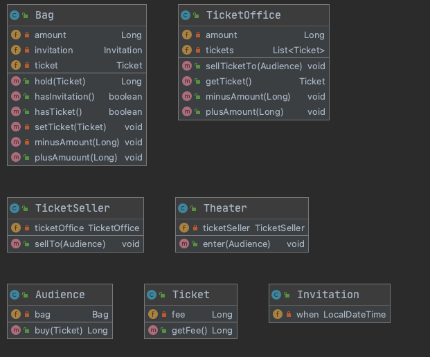

# Chapter 1. 객체, 설계
* 티켓 판매 애플리케이션 구현하기

## 1. 티켓 판매 어플리케이션
### 클래스 정의
* Invitation
    - 초대일자 (date)
* Ticket
    - 티켓 요금 (fee)
* Bag
    - 현금 (amount)
    - 초대장 (Invitation)
    - 티켓 (Ticket)
* Audience
    - 가방 (Bag)
* Ticket Office
    - 판매하거나 교환해 줄 티켓의 목록 (Ticket)
    - 판매금액
* Ticket Seller
    - 티켓 오피스 (TicketOffice)

### Theater 클래스
* 소극장을 구현한 클래스 실제로, 관객에게 금액 혹은 티켓을 받고 입장시키는 로직
~~~java
public class Theater {
    private TicketSeller ticketSeller;
    
    public Theater(TicketSeller ticketSeller) {
        this.ticketSeller = ticketSeller;
    }
    
    // 극장에서 손님을 입장시킨다
    public void enter(Audience audience) {
        // 초대장이 있을 경우
        if (audience.getBag().hasInvitation()) {
            Ticket ticket = ticketSeller.getTicketOffice().getTicket();
            audience.getBag().setTicket(ticket);
        } else {
            Ticket ticket = ticketSeller.getTicketOffice().getTicket();
            audience.getBag().minusAmount(ticket.getFee());
            ticketSeller.getTicketOffice().plusAmount(ticket.getFee());
            audience.getBag().setTicket(ticket);
        }
    }
}
~~~

### 예상을 빗나가는 코드
* 소극장에서 관객의 가방을 열어 직접 티켓을 넣고 요금을 계산
* 이해하기 어렵다, 티켓 셀러는 티켓오피스를 알아야하고 티켓오피스에서 티켓을 가져와 그것을 셀러에 반환
* 이겨웅 Audience 와 TicketSeller를 변경할 경우 Theater도 함께 변경해야함
* 변경에 취약

### 설계 개선하기
* Theater 가 Audience와 ticketSeller의 너무 세세한 부분까지 알지 못하도록 정보를 차단

### 자율성을 높이자
* 첫번째 단계는 Theater의 enter 메서드에서 ticketOffice에 접근하는 모든 코드를 TicketSeller 내부로 숨기는 것
    * sellTo 메서드
    * ticketSeller에 getTicketOffice 제거됨
* 두번째 단계는 Audience의 getBag 을 참조에 대해 자신으로 책임을 옮김
    * buy 메서드 생성
* Bag 역시 자율적인 존재로 바꿔본다면, bag의 내부 상태에 접근하는 모든 로직을 bag로 옮김
    * hold 메서드 생성
* 수정된 Audience 와 TicketSeller는 자신이 가지고 잇는 소지품을 스스로 관리한다
    * 내부 구현을 변경하더라도 Theater 와 함께 변경할 필요가 없다

