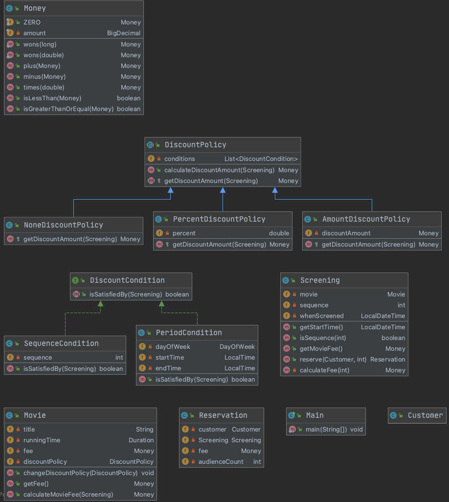

# Chapter 2. 객체지향 프로그래밍

## 협력, 객체, 클래스
* 객체지향 패러다임으로의 전환은 클래스가 아닌 객체에 초점을 맞출 때 얻을 수 있다.
    1. 어떤 클래스가 필요한지를 고민하기 전에 어떤 객체를 필요한지 고민
    2. 객체를 독릭접인 존재가 아니라 기능을 구현하기 위해 협력하는 공동체의 일원으로 본다

## 도메인의 구조를 따르는 프로그램 구조
 * 문제를 해결하기 위해 사용자가 프로그램을 사용하는 분야를 도메인 이라고 함
 * 예제에서의 도메인은 영화 예매를 좀더 쉽고 빠르게 하려는 사용자의 문제를 해결
 

## 클래스의 내부와 외부를 구분해야 하는 이유
 * 경계의 명확성이 객체의 자율성을 보장한다
 * 객체의 자율성
    * 객체라는 단위 안에 데이터와 기능을 한 덩어리로 묶음으로써 문제 영역의 아이디어를 적절하게 표현
 * 일반적으로 객체의 상태는 숨기고, 행동만 외부에 공개해야 한다.
    * 상태를 숨김으로써 숨겨놓은 부분을 외부에서 접근이 불가능 (수정이 불가능), 내부구현 변화에 대해 클라이언트 프로그래머의 영향을 걱정X
 * 객체를 내부와 외부로 구분하면, 프로그래머가 알아야할 지식이 줄어듦.

## 클래스 구현하기
  * Screening
     * 상영활 영화 (movie)
     * 순번 (sequence) 
     * 상영시간 (whenScreened)
     * 예약하기 (reserve)
     * 전체 예매 요금 (calculateFee)
  * Money
    * 금액 (amount)
    * 금액의 표현으로 Long 을 쓸 수 있지만 Money 타입처럼 저장하는 값이 금액과 관련되어 있다는 의미를 전달할 수 없다
  * Reservation
    * 고객 (customer)
    * 상영정보 (Screening)
    * 요금 (fee)
    * 관객수
  * Movie
    * 제목 (title)
    * 러닝타임 (runningTime)
    * 요금 (fee)
    * **할인 정책 (discountPolicy)**
    
    
## 할인 요금 구하기
 * 할인요금 계산을 위한 협력
 * Movie 클래스에서 할인정책에 대해 어떤 할인정책 (amount, rate ?)을 써야할지에 대한 선택을 해야한다
 
## 할인 정책과 할인 조건

~~~java
public abstract class DiscountPolicy {
    private List<DiscountCondition> conditions = new ArrayList<>();
    public DiscountPolicy(DiscountCondition ...conditions) {
        this.conditions = Arrays.asList(conditions);
    }
        
    public Money calculateDiscountAmount(Screening screening) {
        for (DiscountCondition condition : conditions) {
            if (condition.isSatisfiedBy(screening)) {
                return getDiscountAmount(screening);
            }
        }
        return Money.ZERO;
    }
    
    abstract protected Money getDiscountAmount(Screening screening);
}
~~~
~~~java
public interface DiscountCondition {
    boolean isSatisfiedBy(Screening screening);
} 
~~~
* 하나의 할인 정책은 여러개의 할인 조건을 포함
* screening의 조건이 하나라도 부합하는 경우, getDiscountAmount 메서드를 통해 할인 요금을 계산

## 상속과 다형성
 * 코드의 의존성과 실행시점의 의존성이 다를 수 있다.
 * 실제로 Movie 라는 객체가 AmountDiscountPolicy 와 같은 구체적으로 구현된 객체를 직접접근 하기 보단 DiscountPolicy와 같이 부모 클래스를 바라보게 
 설계 한다면 좀더 코드를 유연하고 쉽게 재사용 할 수 있다. ( 실행시점과 코드의 의존성이 달라진다 )
 * DiscountCondition 라는 인터페이스 역시 마찬가지
 * 다만 실행시점과 코드의 의존성이 다르면 다를 수록 코드가 복잡해진다.

## 유연한 설계
~~~java
public class Movie {
    public Money calculateMovieFee(Screening screening) {
        if (discountPolicy == null) return fee;
        return fee.minus(discountPolicy.calculateDiscountAmount(screening));
    }    
}
~~~
* 할인 정책이 적용되어 있지 않은경우
* 할인 금액을 0원이라는 사실을 결정하는 책임이 Movie 쪽에 존재함
* 따라서 0원이라는 할인요금을 계산할 책임을 DiscountPolicy 계층에 유지해야함
~~~java
public class NoneDiscountPolicy extends DiscountPolicy {
    protected Money getDiscountAmount(Screening screening) {
        return Money.ZERO;
    }
}
~~~
* 다음과 같이, 기존 코드를 수정하지 않고 확장이 가능 (OpenClosed)

## 상속 대신 합성
* 상속은 캡슐화를 위반하며, 설계를 유연하지 못하게 한다.
    * 부모 클래스의 구현이 자식 클래스에 노출됨 -> 의존성 발생 (부모 자식간의 의존성도 존재한다), 즉 부모가 바뀌면 자식도 바뀔 가능성이 크다
    * 설계가 유연하지 않다. 상속은 부모 클래스와 자식 클래스 사이의 관계를 컴파일 시점에 결정 -> 실행 시점에 객체의 종류 변경 불가능 (유연성X)
    
~~~java
public class Movie {
    private DiscountPolicy discountPolicy;
    
    public void changeDiscountPolicy(DiscountPolicy discountPolicy) {
        this.discountPolicy = discountPolicy; 
    }
}
~~~
* 다음과 같이 요금을 계산하기 위해 DiscountPolicy 의 코드를 재사용한다. 
* Movie 와 discountPolicy가 약하게 결합되어 유연성을 가진다
* 이처럼 인터페이스에 정의된 메세지를 통해서 코드를 재사용하는 방법을 합성이라고 부른다

