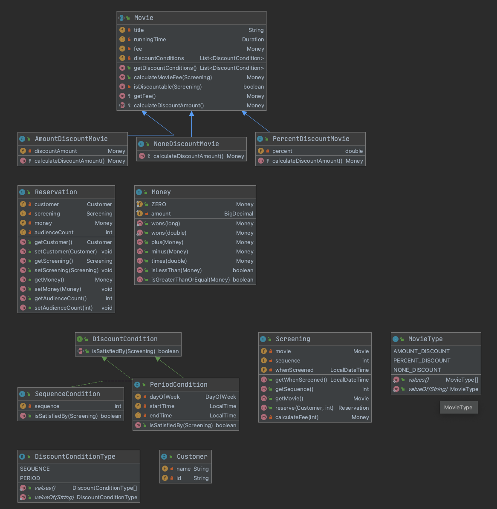

# Chapter 5. 책임 할당하기
> 데이터 중심 설계로 인해 발생하는 문제점을 해결할 수 잇는 가장 기본적인 방법은 데이터가 아닌 책임에 초첨을 맞추는 방법이다.
>

* 책임에 초점을 맞춰 설계할 때, 어떤 객체에게 어떤 책임을 할당해야 하는지 결정하기 쉽지 않다.
* GRASP 패턴은 책임할당의 어려움을 해결하기 위한 답을 제시해 준다.

### 책임 주도 설계를 향해
 * 데이터보다 행동을 먼저 결정하라
    * 행동은 외부에 제공
 * 협력이라는 문맥 안에서 결정하라
 
### 책임 주도 설걔
 * 시스템이 사용자에게 제공해야 하는 기능인 시스템 책임을 파악한다.
 * 시스템 책임을 더 작은 책임으로 분할한다.
 * 분할된 책임을 수행할 수있는 적절한 객체 또는 역할을 찾아 책임을 할당한다.
 * 객체가 책임을 수행하는 도중 다른 객체의 도움이 필요한 경우 이를 책임질 적절한 객체 또는 역할을 찾는다.
 * 해당 객체 또는 역할에게 책임을 할당함으로써 두 객체가협력하게 한다.

### GRASP 패턴
* General Responsibility Assignment Software pattern : 일반적인 책임 할당을 위한 소프트웨어 패턴
1. 도메인 개념에서 출발
    * 설계를 시작하기 전 도메인의 개략적인 모습을 그려보아라
    * 개념들의 의미와 관계가 정확하거나 완벽할 필요는 없다.
2. 정보 전문가에게 책임을 할당하라
    * 애플리케이션이 제공해야 하는 기능을 애플리케이션의 책임으로 생각하는 것
        * 메세지를 전송할 객체는 무엇을 원하는가? 
        * 메세지를 수신할 적합한 객체는 무엇인가
    * 책임을 수행할 정보를 알고있는 객체에게 책임을 할당해야한다.  
3. 높은 응집도와 낮은 결합도
    * 책임을 할당할 수 잇는 다양한 대안들이 존재한다면 응집도와 결합도를 얻을 수 있는 설계를 선택해야한다.
4. 창조자에게 객체 생성 책임을 할당하라

### 구현을 통한 검증

~~~java
public class Screening {
    private Movie movie;   
    private int sequence;
    private LocalDateTime whenScreened;

    public Reservation reserve(Customer customer, int audienceCount) {
        return new Reservation(customer, this, calculateFee(audienceCount), audienceCount);
    }
    public Money calculateFee(int audienceCount) {
        return movie.calculateMovieFee(this).times(audienceCount);
    }

}
~~~
* 협력에서의 Screening은 예매하라 메세지에 응답할 수 있어야 한다.
* 책임을 수행하는데 필요한, 상영시간과 순번을 인스턴스 변수로 포함한다.
* 영화에 계산하라 라는 메세지를 전송해야 하기 때문에 Movie도 포함해야 한다
* 요금을 계산해서 Reservation 메서드를 반환한다

~~~java
public class Movie {
    private String title;
    private Duration runningTime;
    private Money fee;
    private List<DiscountCondition> discountConditions;
    private MovieType movieType;
    private Money discountAmount;
    private double discountPercent;

    public Money calculateMovieFee(Screening screening) {
        if (isDiscountable) {
            return fee.minus(calculateDiscountAmount());
        }
    }
    
    private boolean isDiscountable(Screening screening) {
        return discountConditions.stream().anyMatch(condition -> condition.isSatisfiedBy(screening));
    }   
    
    private Money calculateDiscountAmount() {
        switch (movieType) {
            case AMOUNT_DISCOUNT: return calculateAmountDiscountAmount();
            case PERCENT_DISCOUNT: return calculatePercentDiscountAmount();
            case NONE_DISCOUNT: return calculateNoneDiscountAmount();
        }
        throw new IllegalStateException();

    }
}
~~~
* Screening 이 전송한 메세지에 응답하기 위해 movie 에선 calculateMovieFee 를 선언한다
* 요금을 계산하기 위해 기본금액, 할인조건등의 정책을 알아야 한다
* 할인금액과 할인 비율을 인스턴스 변수로 선언한다 (discountAmount ,discountPercent)
* 어떤 할인 정책이 적용된 영화인지 나타내기 위한 영화종류를 인스턴스 변수로 선언한다 (movieType)
* 할인 조건을 순회하며, 어느 할인조건에 해당하는지 판단한다 (isDiscountable)
* 할인 조건이 존재할 경우 요금을 계산하여 반환한다 (calculateDiscountAmount)

~~~java
public class DiscountCondition {
    private DiscountConditionType type;
    private int sequence;
    private DayOfWeek dayOfWeek;
    private LocalTime startTime;
    private LocalTime endTime;

    public boolean isSatisfiedBy(Screening screening) {
        if (type == DiscountConditionType.PERIOD) {
            return isSatisfiedByPeriod(screening);
        }
        return isSatisfiedBySequence(screening);
    }
    private boolean isSatisfiedByPeriod(Screening screening) {
        // 기간 할인 조건 만족하는지
    }
    
    private boolean isSatisfiedBySequence(Screening screening) {
        // 순번 할인 조건 만족하는지
    }

}
~~~
* 조건 만족여부를 표현한다
* 어떤 조건을 만족하는지에 따라 적절한 메소드를 호출한다

### DiscountCondition 개선하기
* 변경에 취약한 클래스
* 세가지 이유로 변경될 수 있다 
    * 새로운 할인 조건 추가 -> if else 추가
    * 순번 조건을 판단하는 로직 변경 isSatisfiedBySequence, 데이터 변경시 DiscountCondition 의 sequence 속성도 변경해야한다.
    * 기간 조건을 판단하는 로직 변경
* 하나 이상의 변경 이유를 가지기 때문에 응집도가 낮다고 볼 수 있다.
* 변경 이유에 따라 클래스를 분리 해야한다.

### 타입 분리하기
* DiscountCondition의 큰 문제는 기간조건과 순번조건이 하나의 클래스안에 공존하고 있다는 점이다.
* 해결 방법은 두 타입을 두개의 클래스로 나누는 것이다.

~~~java
public class PeriodCondition{
    private DayOfWeek dayOfWeek;
    private LocalTime startTime; 
    private LocalTime endTime;
    

    public boolean isSatisfiedBy(Screening screening) {
        // 기간할인조건
    }   
}

public class SequenceCondition{
    private DayOfWeek dayOfWeek;
    private LocalTime startTime; 
    private LocalTime endTime;
    

    public boolean isSatisfiedBy(Screening screening) {
        // 기간할인조건
    }   
}
~~~

* 분리된 후에도 문제점이 발생한다.
    * Movie와 협력하는 클래스는 DiscountCondition 뿐이였지만, 이젠 PeriodCondition과 SequenceCondition 두개로 나뉘어 졌다
* 이 후 새로운 할인 조건을 추가해야 했을 때, 새로운 할인조건에 대한 클래스를 만들고 Movie에 List로 인스턴스 변수를 추가해야한다. 또 이 메서드를 호출하도록
isDiscountable 메소드를 수정해야 한다.

### 다형성을 통해 분리하기
* SequenceCondition과 PeriodCondition은 같은 역할을 수행한다.
* 역할은 협력 안에서 대체 가능성을 의미한다.
* 역할을 사용하면 객체의 구체적인 타입을 추상화 할 수 있다. 
* 구현을 공유할 필요 없이 역할을 대체하는 객체의 책임만 정의하고 싶다면 인터페이스를 이용한다.

~~~java
public interface DiscountCondition {
    boolean isSatisfiedBy(Screening screening);
}

public class PeriodCondition implements DiscountCondition{}
public class SequenceCondition implements DiscountCondition{}
~~~

~~~java
public class Movie {
    private List<DiscountCondition> discountConditions;
    
    public Money calculateMovieFee(Screening screening) {
        if (isDiscountable(screening)) {
            return fee.minus(calculateDiscountAmount());
        }
    }
}
~~~
* 이제 협력하는 객체의 구체적인 타입을 몰라도 상관없다.
* Movie가 전송한 메세지를 수신한 객체의 구체적인 클래스(PeriodCondition, SequenceCondition )가 무엇이엇는지에 따라 적절한 메서드가 실행된다
* 객체의 타입에 따라 변하는 행동이 있다면 타입을 분리하고 변화하는 행동을 각태입의 책임으로 할당하라.

### Movie 클래스 개선하기
* 할인 정책의 종류에 따라 할인 금액을 계산하는 로직이 달라져야 한다. 이를 위해, calculateDiscountAmount를 추상메서드로 선언함으로써 해결한다.

~~~java
public class AmountDiscountMovie extends Movie {
    private Money discountAmount;
    
    protected Money calculateDiscountAmount() {
        return discountAmount;
    }
}

public class PercentDiscountMovie extends Movie {
    private Money discountAmount;
    
    protected Money calculateDiscountAmount() {
        return getFee().times(percent);
    }
}
~~~
* 이 때 getFee는 서브클래스에서만 사용해야 하므로 protected로 선언한다

